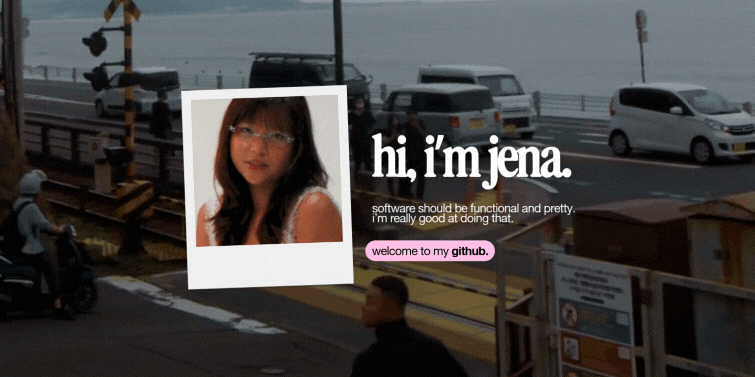

  <a href="https://jenabathan.com/">my website ↗</a> &nbsp; · &nbsp;
  <a href="https://jenabathan.com/#projects">view my work ↗</a> &nbsp; · &nbsp;
  <a href="mailto:jenamaribathan@gmail.com">say hello ↗</a>

## a little about me .✦ ݁˖

I'm Jena — a Computer Science student at the University of Wollongong, studying Software Engineering as a Dean's Scholar. I like turning ideas into things that work beautifully, from the interface to the systems behind it.

A few stamps collected along the way:

- **top 5%** of my Computer Science cohort at UOW.
- - **2x** hackathon winner, lead frontend and full-stack engineer for both.
- **150+ members** in the university organisation I founded and grew.
- **frontend development & design** led creative initiatives during a startup internship.

## my tech stack ⋆˚꩜｡

Tools and technologies I've worked with — freshly pinned up.

| | in my toolkit |
| :--- | :--- |
| **languages** | Python · Java · JavaScript · TypeScript · C++ · SQL · C# |
| **frontend & backend** | React · Spring Boot · REST APIs · Tailwind CSS · JavaFX |
| **data & machine learning** | Pandas · NumPy · scikit-learn · RapidMiner · Matplotlib · Seaborn · Clustering · Statistical Analysis |
| **AI & systems** | Gemini & OpenAI APIs · Exposure to agentic AI |
| **tools** | Docker · Git/GitHub · Vite · Google Colab · MySQL · VS Code |
| **design & UI/UX** | Figma · Procreate · UI/UX Design · Prototyping |

## a postcard from my corner of the internet ⋆ ˚｡ ⋆୨💌୧⋆ ˚｡

I enjoy building clean, visually engaging products and bringing a little personality to the details. You can find my projects, design work, and the rest of my journey on **[jenabathan.com](https://jenabathan.com/)**.

Got a project, an opportunity, or something you'd like to talk about? I'd love to hear from you.

**[email me](mailto:jenamaribathan@gmail.com)** &nbsp; / &nbsp; **[find me on linkedin](https://www.linkedin.com/in/jenabathan/)**

 

  made with love, matcha, and coffee. — jena ♡

